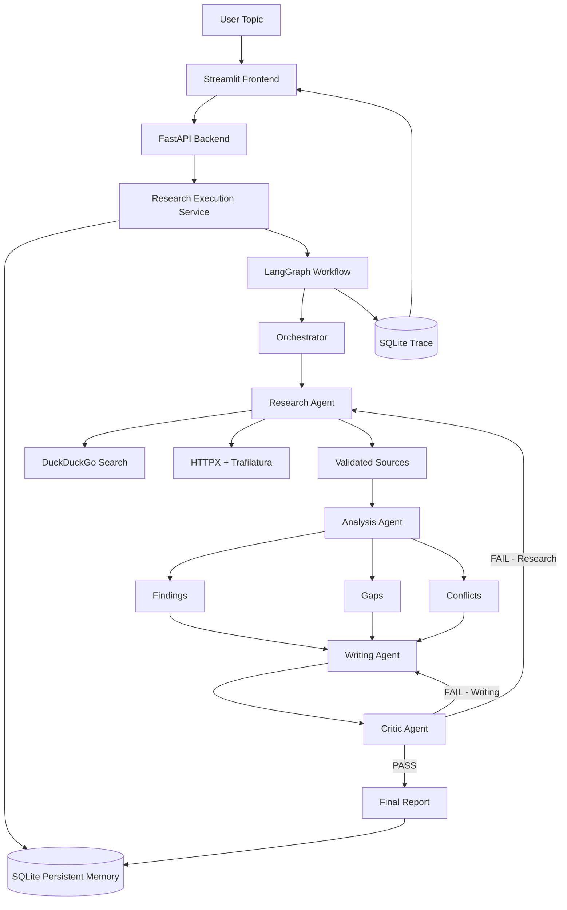
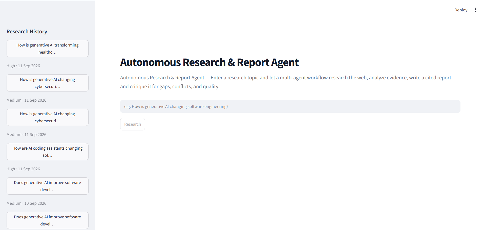
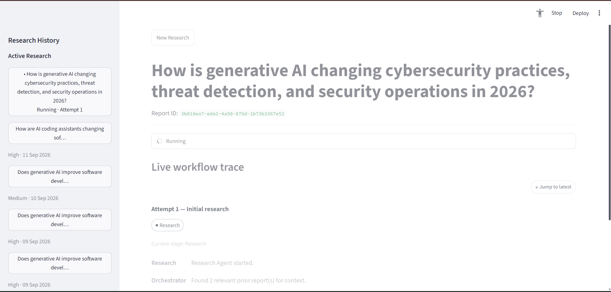
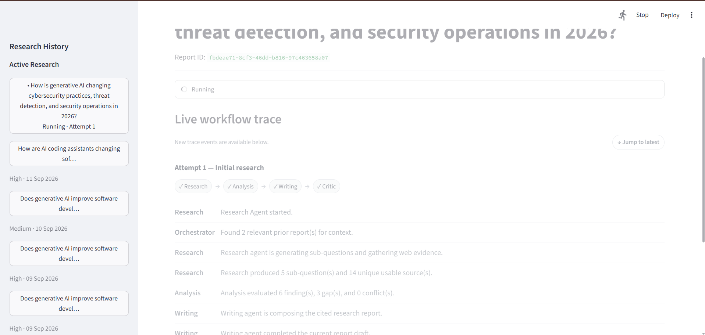
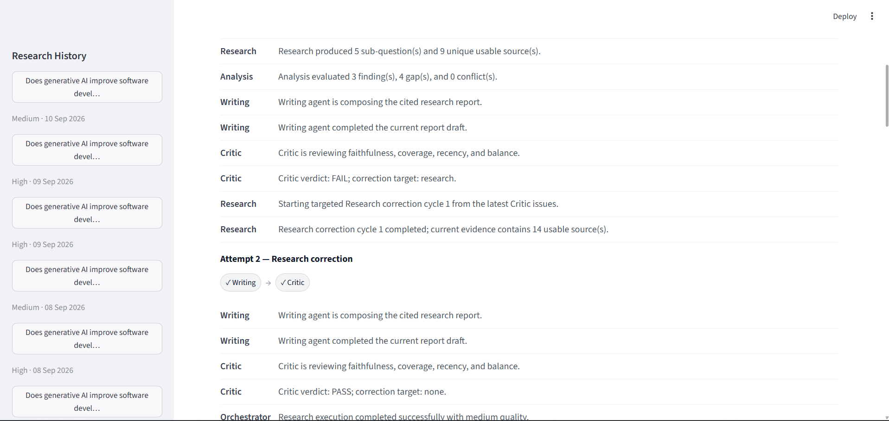
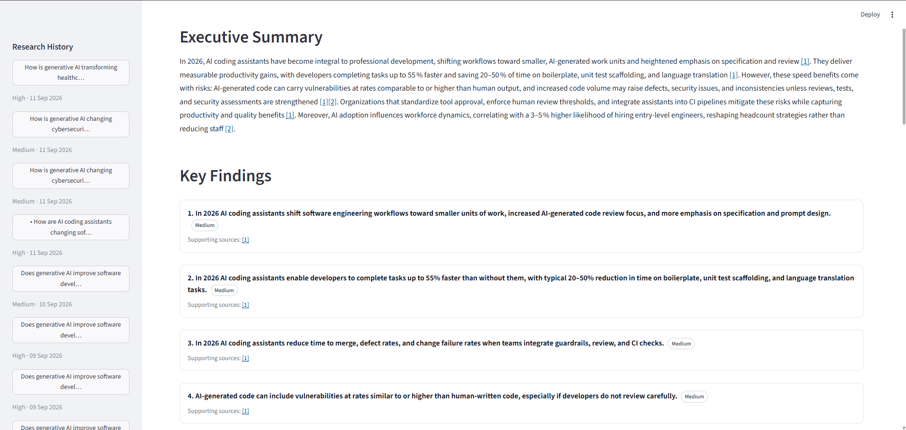
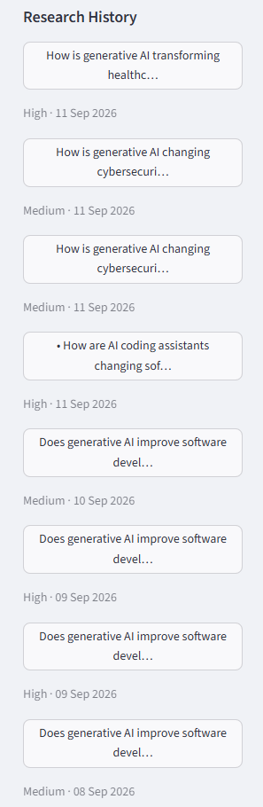
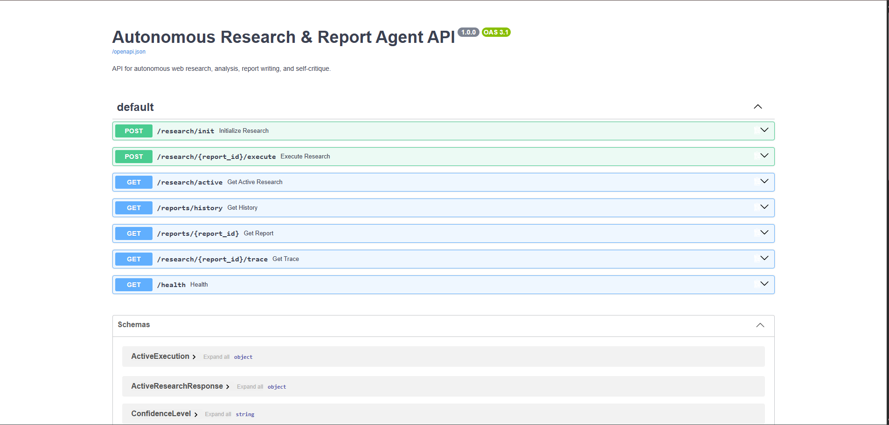

# Autonomous Research & Report Agent

An autonomous multi-agent research system that turns a research topic into a structured, cited report through a coordinated **Research → Analysis → Writing → Critic** workflow.

The system autonomously decomposes a topic into focused sub-questions, searches the live web for evidence, validates and analyzes retrieved sources, generates a structured research report, evaluates its own output, and performs targeted correction cycles when the Critic detects research or writing deficiencies.

Built with **Python, LangGraph, Groq, DuckDuckGo, FastAPI, Streamlit, and SQLite**.

---

## Overview

Traditional LLM-based research workflows often rely on a single model to search, reason, write, and evaluate its own answer. That makes it difficult to separate responsibilities, trace failures, preserve evidence, or systematically improve weak reports.

This project addresses that problem through a modular multi-agent architecture.

A research request moves through specialized stages:

```text
User Topic
    │
    ▼
Orchestrator
    │
    ▼
Research Agent
    │
    ├── Generate focused sub-questions
    ├── Search the web
    ├── Select relevant candidates
    └── Fetch and validate source content
    │
    ▼
Analysis Agent
    │
    ├── Extract findings
    ├── Assess evidence
    ├── Identify gaps
    └── Detect conflicting information
    │
    ▼
Writing Agent
    │
    ├── Executive summary
    ├── Key findings
    ├── Supporting evidence
    ├── Gaps / conflicts
    └── References and citations
    │
    ▼
Critic Agent
    │
    ├── Faithfulness
    ├── Coverage
    ├── Recency
    └── Balance
    │
    ├────────────── PASS ──────────────► Final Report
    │
    └────────────── FAIL
                    │
                    ▼
            Targeted Correction
                    │
              ┌─────┴─────┐
              ▼           ▼
          Research     Writing
          Correction   Correction
```

The complete workflow is implemented as a **LangGraph state machine**.

---

## Key Features

### Multi-Agent Research Pipeline

Each stage has a clearly separated responsibility:

| Agent | Responsibility |
|---|---|
| **Orchestrator** | Controls workflow routing and correction cycles |
| **Research Agent** | Decomposes topics, searches the web, retrieves sources |
| **Analysis Agent** | Converts evidence into findings, gaps, and conflicts |
| **Writing Agent** | Produces the structured cited report |
| **Critic Agent** | Evaluates report quality and determines whether correction is required |

---

### Autonomous Web Research

The Research Agent:

1. Generates 4–5 focused sub-questions.
2. Searches the live web using DuckDuckGo.
3. Evaluates the search candidates.
4. Selects the most relevant sources.
5. Fetches source content.
6. Extracts usable page text.
7. Deduplicates sources globally.
8. Assigns stable citation IDs.

The retrieval layer uses:

- `ddgs`
- `httpx`
- `trafilatura`
- `BeautifulSoup`

---

### Evidence-Grounded Analysis

The Analysis Agent works from retrieved evidence rather than generating unsupported claims.

It produces:

- Findings
- Supporting source relationships
- Confidence levels
- Research gaps
- Evidence gaps
- Conflicting information

Confidence is determined from the available evidence rather than from a subjective model score.

---

### Critic-Driven Self-Evaluation

The Critic Agent independently evaluates the generated report across four dimensions:

- **Faithfulness**
- **Coverage**
- **Recency**
- **Balance**

The Critic produces a deterministic:

```text
PASS
```

or:

```text
FAIL
```

When a report fails, the Orchestrator determines the appropriate correction target.

Research deficiencies trigger another targeted Research cycle, while writing-specific deficiencies trigger a Writing correction.

Correction cycles are bounded to prevent unbounded retries.

---

### Persistent Research Memory

Completed reports are stored persistently in SQLite.

Future research can retrieve relevant previous reports and use them as **planning context**.

Memory is deliberately separated from research evidence:

```text
Previous Reports
      │
      ▼
Memory Retrieval
      │
      ▼
Planning Context

Live Web Sources
      │
      ▼
Research Evidence
```

Previous reports guide research planning but are never treated as direct evidence for newly generated claims.

---

### Live Workflow Trace

The Streamlit interface exposes the workflow as it executes.

The interface shows:

```text
Research
   ↓
Analysis
   ↓
Writing
   ↓
Critic
```

and displays execution events such as:

```text
Research Agent started.
Found 2 relevant prior report(s) for context.
Research agent is generating sub-questions and gathering web evidence.
Research produced 5 sub-question(s) and 13 unique usable source(s).
Analysis evaluated 8 finding(s), 5 gap(s), and 0 conflict(s).
Writing agent completed the current report draft.
Critic verdict: PASS; correction target: none.
Research execution completed successfully with high quality.
```

Correction runs are displayed as separate attempts, making it possible to follow how the system responded to Critic feedback.

---

### Structured Final Reports

Generated reports contain:

- Executive Summary
- Key Findings
- Supporting Evidence
- Identified Gaps
- Conflicting Information
- References

Findings display confidence indicators and supporting source relationships.

Inline citations connect report claims to numbered references.

---

### Robust Structured-Output Handling

The system includes deterministic validation around structured LLM output.

Examples include recovery from malformed provider output such as:

```text
Need 3 most relevant. Likely 1,4,3 maybe.
```

and malformed structured JSON such as:

```json
{"selected_indices":[1,3,2]
```

Only narrowly defined, explicitly recoverable formats are accepted, and recovered values still pass the application's deterministic validation rules.

Unrelated provider errors are not silently recovered.

---

### Model Fallback Strategy

The application uses a configurable primary/fallback LLM strategy.

Current configuration:

```env
PRIMARY_MODEL=openai/gpt-oss-20b
FALLBACK_MODEL=qwen/qwen3.8-27b
```

Fallback is reserved for retryable provider conditions such as:

- Model availability problems
- Rate limits
- Timeouts
- Transient network failures
- Temporary provider/server failures

Application and schema errors are not automatically treated as fallback conditions.

---

## Architecture



---

## Workflow

### 1. Research

The Research Agent generates focused sub-questions and gathers evidence from the live web.

Search candidates are validated before being accepted as evidence.

### 2. Analysis

The Analysis Agent evaluates retrieved evidence and creates structured findings.

It also identifies:

- Research gaps
- Evidence gaps
- Conflicting information
- Confidence levels

### 3. Writing

The Writing Agent converts the validated analysis into a structured report.

The writer is constrained to the analytical information supplied by the previous stage and cannot independently redefine the underlying findings or source relationships.

### 4. Critic

The Critic reviews the draft independently.

It checks:

```text
Faithfulness
Coverage
Recency
Balance
```

### 5. Targeted Correction

When the Critic returns `FAIL`, the Orchestrator routes only the deficient part of the workflow for correction.

```text
Critic
  │
  ├── Research issue ──► Targeted Research Correction
  │
  └── Writing issue ───► Writing Correction
```

Correction cycles are bounded to prevent infinite loops.

---

## Research Quality Controls

The project contains multiple deterministic safeguards around LLM-generated content.

### Source Selection

When five search results are available, the system selects exactly three candidates using structured output followed by deterministic validation.

### Source Validation

Retrieved pages must provide enough usable text to be considered evidence.

### URL Deduplication

The same URL is assigned one citation ID even when it is encountered by multiple sub-questions.

### Citation Preservation

Findings retain their supporting source relationships throughout the workflow.

### Confidence Calculation

Confidence is derived from the available evidence:

```text
2+ independent agreeing sources → HIGH

1 supporting source              → MEDIUM

Weak / ambiguous / conflicting   → LOW
```

### Gap Detection

The system distinguishes between:

- Research gaps
- Evidence gaps

This allows the final report to distinguish missing research coverage from insufficient retrieved evidence.

### Correction Limits

The Critic-driven correction loop is bounded to avoid indefinite retries.

---

## Persistent Storage

SQLite is used as the source of truth for:

- Research executions
- Completed reports
- Execution status
- Workflow traces
- Persistent research memory

The runtime database is created at:

```text
data/research_agent.db
```

Local runtime data is excluded from version control.

---

## Technology Stack

| Technology | Purpose |
|---|---|
| **Python 3.11** | Application language |
| **LangGraph** | Workflow orchestration |
| **LangChain** | LLM/agent integration |
| **Groq** | LLM provider |
| **DDGS** | Web search |
| **HTTPX** | HTTP requests |
| **Trafilatura** | Main webpage text extraction |
| **BeautifulSoup** | HTML fallback parsing |
| **FastAPI** | REST backend |
| **Uvicorn** | ASGI server |
| **Streamlit** | Frontend |
| **SQLite** | Persistent storage |
| **Pytest** | Automated testing |

---

## Project Structure

```text
autonomous-research-agent/
│
├── docs/
│   ├── screenshots/
│   │   ├── 01_home_workspace.png
│   │   ├── 02_research_execution.png
│   │   ├── 03_live_agent_trace.png
│   │   ├── 04_correction_attempt.png
│   │   ├── 05_final_report.png
│   │   ├── 06_report_history.png
│   │   └── 07_api_documentation.png
│   │
│   └── reports/
│       ├── software_engineering_report.pdf
│       ├── cybersecurity_report.pdf
│       └── healthcare_report.pdf
│
├── frontend/
│   ├── api_client.py
│   ├── app.py
│   ├── models.py
│   └── __init__.py
│
├── src/
│   ├── agents/
│   │   ├── analysis_agent.py
│   │   ├── critic_agent.py
│   │   ├── orchestrator.py
│   │   ├── research_agent.py
│   │   ├── writing_agent.py
│   │   └── __init__.py
│   │
│   ├── api/
│   │   ├── errors.py
│   │   ├── main.py
│   │   ├── routes.py
│   │   ├── schemas.py
│   │   └── __init__.py
│   │
│   ├── core/
│   │   ├── evidence_compaction.py
│   │   ├── execution.py
│   │   ├── llm.py
│   │   ├── persistence.py
│   │   └── __init__.py
│   │
│   ├── graph/
│   │   └── __init__.py
│   │
│   ├── memory/
│   │   └── __init__.py
│   │
│   ├── models/
│   │   ├── schemas.py
│   │   └── __init__.py
│   │
│   ├── serving/
│   │   └── __init__.py
│   │
│   ├── tools/
│   │   ├── page_fetcher.py
│   │   ├── web_search.py
│   │   └── __init__.py
│   │
│   ├── workflow.py
│   └── __init__.py
│
├── tests/
│   ├── __init__.py
│   ├── test_analysis_agent.py
│   ├── test_api.py
│   ├── test_critic_agent.py
│   ├── test_evidence_compaction.py
│   ├── test_execution.py
│   ├── test_frontend_api_client.py
│   ├── test_frontend_workspace.py
│   ├── test_llm_schema.py
│   ├── test_llm.py
│   ├── test_orchestrator.py
│   ├── test_page_fetcher.py
│   ├── test_persistence.py
│   ├── test_phase19_report_schema.py
│   ├── test_research_agent.py
│   ├── test_web_search.py
│   ├── test_workflow.py
│   └── test_writing_agent.py
│
├── .env.example
├── .gitignore
├── requirements.txt
├── requirements-dev.txt
└── README.md
```

---

## Getting Started

### 1. Clone the repository

```powershell
git clone https://github.com/omhunagund/autonomous-research-agent.git
cd autonomous-research-agent
```

### 2. Create the Python environment

This project uses Python 3.11.

```powershell
py -3.11 -m venv .venv
```

Activate the environment:

```powershell
.\.venv\Scripts\Activate.ps1
```

### 3. Install dependencies

Install runtime dependencies:

```powershell
pip install -r requirements.txt
```

Install development/test dependencies:

```powershell
pip install -r requirements-dev.txt
```

### 4. Configure environment variables

Create `.env` from the example:

```powershell
Copy-Item .env.example .env
```

Then configure:

```env
GROQ_API_KEY=your_groq_api_key
PRIMARY_MODEL=openai/gpt-oss-20b
FALLBACK_MODEL=qwen/qwen3.8-27b
```

`GROQ_API_KEY` is required.

---

## Running the Application

### Start the FastAPI Backend

From the project root:

```powershell
python -m uvicorn src.api.main:app --host 127.0.0.1 --port 8000
```

The API will be available at:

```text
http://localhost:8000
```

Health check:

```powershell
Invoke-RestMethod http://localhost:8000/health
```

Expected response:

```json
{
  "status": "ok"
}
```

FastAPI documentation is available at:

```text
http://localhost:8000/docs
```

---

### Start the Streamlit Frontend

Open a second terminal, activate the same virtual environment, and run:

```powershell
python -m streamlit run frontend/app.py --server.address 127.0.0.1 --server.port 8501
```

The dashboard will be available at:

```text
http://localhost:8501
```

The frontend uses:

```env
RESEARCH_AGENT_API_URL
```

for the backend URL when an override is required.

Default backend URL:

```text
http://localhost:8000
```

---

## API

### Health

```http
GET /health
```

Returns:

```json
{
  "status": "ok"
}
```

---

### Initialize Research

```http
POST /research/init
```

Creates a new research execution.

Example response:

```json
{
  "report_id": "uuid",
  "status": "running"
}
```

---

### Execute Research

```http
POST /research/{report_id}/execute
```

Executes the initialized research workflow.

Successful response:

```json
{
  "report_id": "uuid",
  "status": "completed"
}
```

---

### Get Workflow Trace

```http
GET /research/{report_id}/trace
```

Returns the current execution status and trace events.

---

### Get Active Research

```http
GET /research/active
```

Returns currently running research executions.

Active executions are ordered newest-first.

---

### Get Research Report

```http
GET /reports/{report_id}
```

Returns a completed research report.

---

### Research History

```http
GET /reports/history
```

Returns completed reports available to the frontend history view.

---

### API Documentation

FastAPI automatically exposes:

```text
/docs
/redoc
/openapi.json
```

---

## Testing

Run the complete test suite:

```powershell
pytest -q
```

The current validated test suite contains:

```text
226 passed
```

with one existing dependency deprecation warning from Starlette/AnyIO.

The test suite covers areas including:

- Research planning
- Search candidate validation
- Web retrieval behavior
- Source deduplication
- Analysis validation
- Writing behavior
- Critic routing
- Correction cycles
- LLM fallback behavior
- Persistence
- Execution lifecycle
- API routes
- Concurrency
- Trace handling
- Frontend state management

---

## Example Research Topics

The system has been live-tested across multiple domains, including:

### Software Engineering

> How are AI coding assistants changing software engineering workflows, code quality, and developer productivity in 2026?

### Cybersecurity

> How is generative AI changing cybersecurity practices, threat detection, and security operations in 2026?

### Healthcare

> How is generative AI transforming healthcare delivery, clinical decision-making, and patient outcomes in 2026?

These tests exercised the complete Research → Analysis → Writing → Critic workflow and produced persistent report history entries.

---

## Screenshots

The screenshots below demonstrate the main user-facing capabilities of the Autonomous Research & Report Agent, including research execution, live multi-agent tracing, self-correction, report generation, persistent history, and the FastAPI backend.

### 1. Research Workspace

The main Streamlit workspace where a user enters a research topic and starts a new research execution.



### 2. Research Execution

The application while an active research task is being executed, showing the live execution state and progress through the workflow.



### 3. Live Agent Trace

The live workflow trace showing the progression through the Research, Analysis, Writing, and Critic stages.



### 4. Self-Correction and Revision

A research execution that required a correction cycle, demonstrating the Critic-driven retry and targeted revision workflow.



### 5. Final Research Report

The completed document-style report showing the Executive Summary, Key Findings, Supporting Evidence, Research Gaps, Conflicting Information, confidence indicators, and references.



### 6. Persistent Report History

The history sidebar showing previously completed research reports and allowing a previous report to be selected and reviewed again.



### 7. FastAPI Documentation

The FastAPI Swagger UI showing the available research, trace, active-execution, and health endpoints.



---

## Example Final Report

A typical final report contains:

```text
Executive Summary
        ↓
Key Findings
        ↓
Supporting Evidence
        ↓
Gaps
        ↓
Conflicts
        ↓
References
```

Each finding is connected to supporting evidence and numbered source citations.

The final report also exposes the quality assessment produced by the Critic-driven workflow.

---

## Error Handling

The application distinguishes between different classes of failures.

### Recoverable Provider Failures

These may trigger the configured LLM fallback:

- Temporary provider/server errors
- Rate limiting
- Network failures
- Timeouts
- Model availability failures

### Structured Output Failures

Specific malformed provider outputs may undergo narrowly scoped deterministic recovery.

Recovered data is always passed through the application's validation layer before being accepted.

### Application Errors

The system does not silently reinterpret application-level validation failures or malformed requests as provider failures.

Failed executions are persisted as terminal failures and are not incorrectly represented as successful research reports.

---

## Concurrency

The application supports multiple research executions simultaneously.

Each execution receives its own:

- Report ID
- Execution state
- Trace
- Persistence lifecycle

The frontend can display multiple active research executions through the Active Research section.

---

## Trace and Observability

Execution traces are persisted independently from final reports.

Trace events include information such as:

```text
event_id
report_id
timestamp
stage
event_type
message
attempt
```

Raw LLM prompts, responses, and token payloads are not exposed in the user-facing trace.

This allows users to understand workflow progress without exposing internal model traffic.

---

## Configuration

### `.env`

```env
GROQ_API_KEY=your_groq_api_key
PRIMARY_MODEL=openai/gpt-oss-20b
FALLBACK_MODEL=qwen/qwen3.8-27b
```

### Frontend API Override

```env
RESEARCH_AGENT_API_URL=http://localhost:8000
```

The frontend defaults to:

```text
http://localhost:8000
```

when no override is supplied.

---

## Requirements

Runtime dependencies are pinned in `requirements.txt`.

Development dependencies are pinned in:

```text
requirements-dev.txt
```

Current development test dependency:

```text
pytest==9.1.1
```

The application currently targets:

```text
Python 3.11
```

---

## Current Limitations

The system is designed as a research and demonstration application rather than a fully hardened production research platform.

Current limitations include:

- Web research quality depends on the availability and accessibility of external webpages.
- Some webpages may block automated retrieval or provide insufficient usable text.
- DuckDuckGo search results can vary over time.
- LLM output remains dependent on the selected model/provider.
- Persistent memory currently uses keyword/token-overlap retrieval rather than vector embeddings.
- Research quality depends on the retrieved evidence available during an execution.
- Local SQLite storage is intended for the current application architecture rather than large distributed deployments.
- Cloud deployment and production authentication are outside the current implementation.

---

## Future Improvements

Potential future extensions include:

- Cloud deployment
- Authentication and authorization
- Distributed persistent storage
- Vector-based long-term research memory
- Additional search providers
- Academic-paper retrieval
- More advanced source-quality assessment
- Richer observability and metrics
- Background job infrastructure
- User-level research collections
- Export to additional document formats
- Scheduled research jobs
- Larger-scale concurrent execution

---

## Development Philosophy

The project emphasizes:

**Modularity**

Each agent and service has a clearly defined responsibility.

**Evidence grounding**

Research claims are tied to retrieved sources.

**Deterministic validation**

LLM-generated structured outputs are validated before being accepted.

**Self-evaluation**

The Critic independently evaluates report quality.

**Targeted correction**

Only the deficient workflow stage is re-run when possible.

**Traceability**

Users can observe the workflow rather than receiving only an opaque final answer.

**Persistence**

Completed research becomes reusable context for future investigations.

---

## Project Status

The core implementation is complete and has been validated through automated testing and live end-to-end executions.

Current validation:

```text
Automated tests: 226 passed
Live multi-domain research: validated
FastAPI backend: validated
Streamlit frontend: validated
Persistent report history: validated
Critic correction loop: validated
Structured-output recovery: validated
```

The project is currently in the final **Polish & Publish** stage, focused on documentation, architecture visuals, sample reports, screenshots, demo recording, and repository presentation.

---

## Author

### Om Hunagund

Computer Science Engineering — Data Science

GitHub:

https://github.com/omhunagund

LinkedIn:

https://linkedin.com/in/om-hunagund